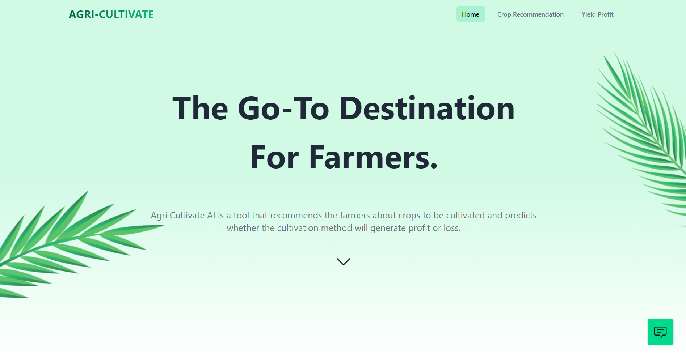

<h1 align="center">Agri-Cultivate 🌾</h1>

    <a href="https://agri-cultivate.vercel.app/">View Website</a> | <a href="https://youtu.be/XmeU1cPr8wU">View Video</a>

Agri Cultivate AI is a tool that recommends the farmers about crops to be cultivated and predicts whether the cultivation method will generate profit or loss.

 

## Technologies Used

## Features
The Machine Learning models are created by setting up a deployment space on IBM Watson Studio where we created an asset for the jupyter notebook on which we shipped our code to create an API Endpoint so that the desired output can be presented on our website.

* [Crop Recommendation](#crop-recommendation)
* [Yield Profit](#yield-profit)
* [ChatBot](#chatbot)

## Crop Recommendation

As far as which crop to grow is concerned, multiple parameters such as amount of nitrogen, phosphorus, potassium, the average temperature of the soil, humidity, average pH value and annual rainfall into consideration.  This model is able to predict among 22 major crop species which are grown in India. Random Forest Classifier algorithm has been implemented giving an accuracy of 97%.

## Yield Profit

For the prediction of the profit from the crop yield, we have taken the parameters crop, state, cost of cultivation per hectare, cost of production, yield (quintal/hectare) and support price.  Used Logistic Regression for predicting if the farmer will be profited or suffer a loss. Achieved an accuracy of 95% on test data.

## ChatBot

The ChatBot is created using the IBM Watson assistant platform. Using it, a user can communicate with the bot and ask queries such as "What are the top five crops in Punjab?"  The bot also assists users with problems such as crop recommendation and yield profit, among other things.

## Team Members

<a href="https://github.com/kanavmittal/">Kanav Mittal</a> 
<a href="https://github.com/samankgupta/">Samank Gupta</a> 
<a href="https://github.com/sarthak91-debug/">Sarthak Tyagi</a> 
<a href="https://github.com/karmabir/">Karmabir Chakraborty
</a> 
